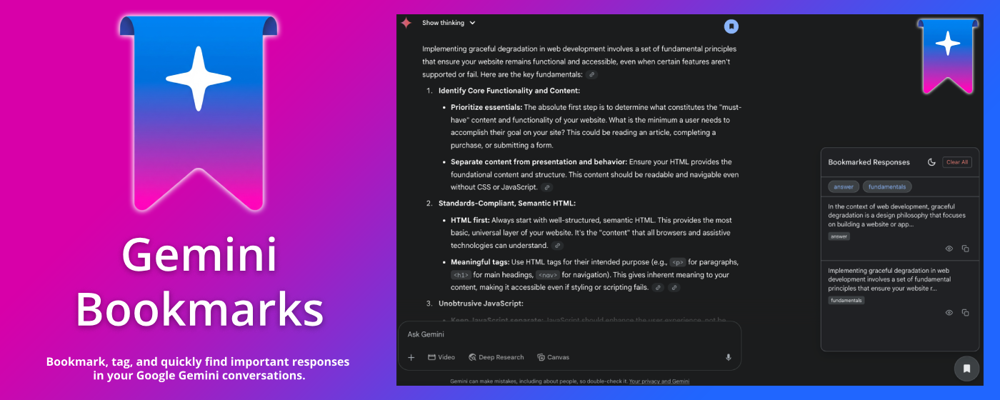
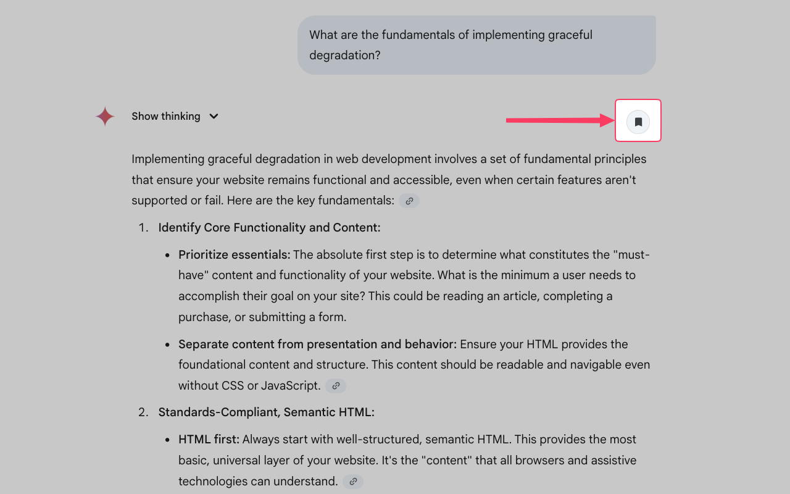
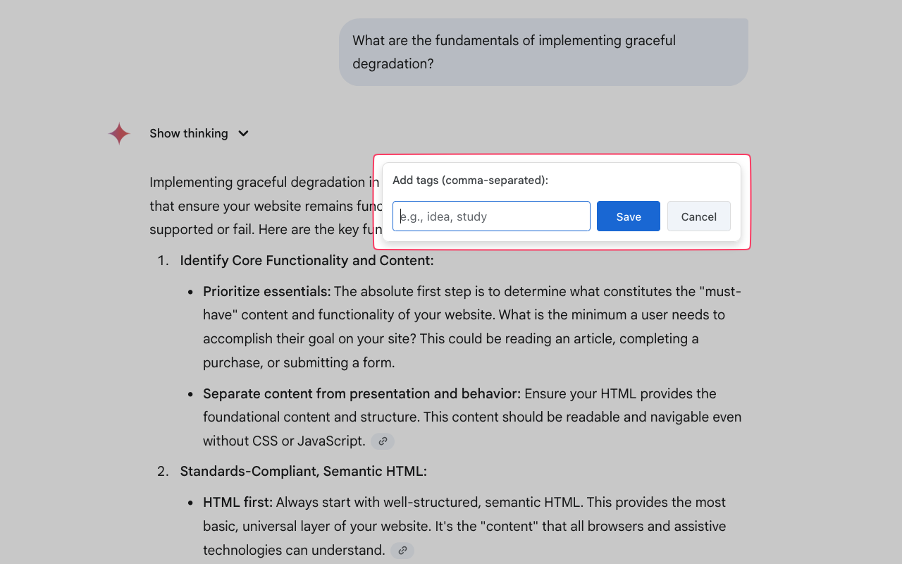
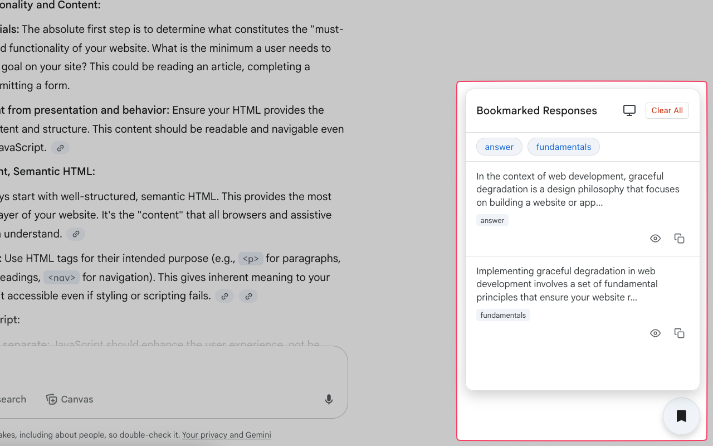
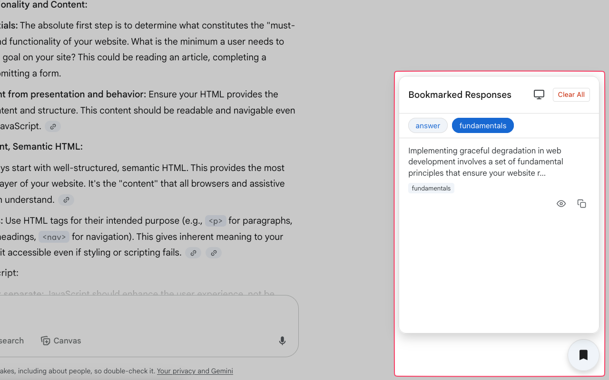
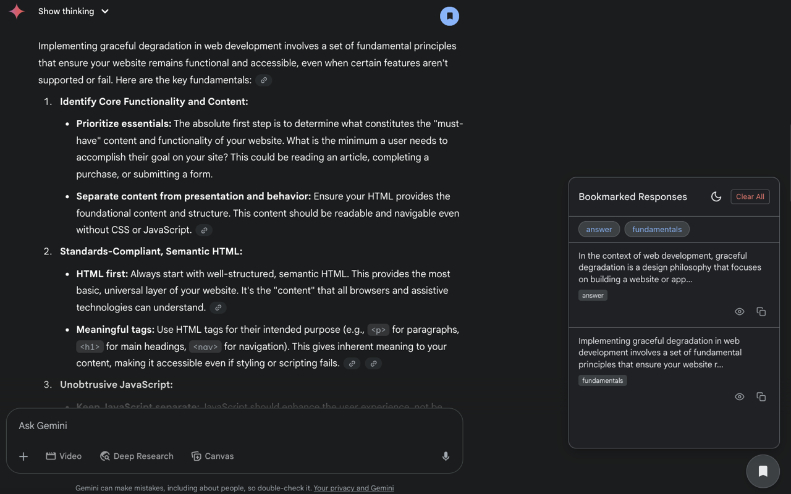
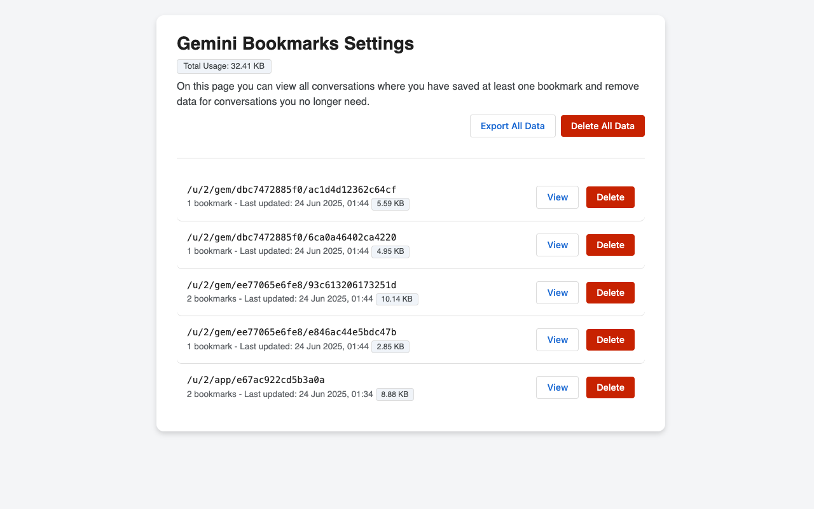

# Gemini Bookmarks

Bookmark, tag, and quickly find important responses in your Google Gemini
conversations.



## Previews

<div align="center">
  
  
</div>

<div align="center">
  
  
</div>

<div align="center">
  
  
</div>

## Get the extension

The extension is available for download at:

- Chrome: [Web Store]()
- Firefox: [Firefox Add-ons]()

## Features

- **One-click Bookmarking:** A bookmark icon appears on every Gemini response in
  a conversation.
- **Tagging System:** Add custom, comma-separated tags to organize your
  bookmarks.
- **Side Panel UI:** A dedicated panel lists all your bookmarks, sorted by their
  position in the conversation.
- **Tag-Based Filtering:** Quickly filter your bookmarks by clicking on tags in
  the panel.
- **Smart Scrolling:** Clicking a bookmark smoothly scrolls the page to its
  original context in a long chat.
- **Keyboard shortcuts:** When using the tag editor or one of the modals, you
  can hit `Enter` to save or `Esc` to cancel/close.
- **Light & Dark Themes:** The UI comes with a light and dark theme that can
  sync with your OS preference.
- **Copy & View Actions:** Quickly copy a bookmark's content to your clipboard
  or view the full text in a modal directly from the side panel.
- **Conversation Management:** On the options page, view all conversations with
  bookmarks and delete data for specific conversations you no longer need.

## Getting Started

This section will explain how to get the project setup locally for development.

### Dependencies

To work with this project you will need the following dependencies:

- Node.js v20+
  - https://nodejs.org/en/download
  - https://github.com/Schniz/fnm
  - https://github.com/nvm-sh/nvm

### Get the Source

This project is hosted at: https://github.com/nrednav/gemini-bookmarks

You can clone the project locally via HTTPS or SSH:

```bash
git clone https://github.com/nrednav/gemini-bookmarks.git
git clone git@github.com:nrednav/gemini-bookmarks.git
```

### Install

To install the project's dependencies:

```
cd gemini-bookmarks/
npm install
```

### Build

Build the extension for a specific browser using:

```
npm run build:chrome
npm run build:firefox
```

This will output the extension files into a sub-directory named `dist` within
the `gemini-bookmarks` directory.

### Test

This project uses [Vitest](httpss://vitest.dev/) for unit testing. To run the
test suite:

```bash
npm test
```

This will execute all test files named with the `.test.js` pattern.

### Run

To install & run the extension manually, follow these steps:

1. Chrome

    - Run `npm run build:chrome`
    - Open your browser and navigate to: `chrome://extensions`
    - Enable `Developer Mode`
    - Click `Load unpackaged`
    - Select the `dist/` directory of this project

2. Firefox

    - Run `npm run build:firefox`
    - Temporary
      - Open your browser and navigate to: `about:debugging`
      - Click `This Firefox`
      - Click `Load Temporary Add-on...`
      - Select the `manifest.json` file in the `dist/` directory of this project
    - Persistent
      - Install the `web-ext` tool from Mozilla: [Link](https://extensionworkshop.com/documentation/develop/getting-started-with-web-ext/)
      - Test the extension by running `web-ext run` from within `dist/` directory
        - Visit any conversation page within Google Gemini and hover over a
          model response to see the bookmark button
      - Sign the extension with `web-ext sign`
        - Follow the instructions on the same page linked above
        - You will need to run this command within the `dist` directory too
        - At the end, you should have a `.xpi` file generated within a sub-directory
          named `web-ext-artifacts`
      - In your Firefox browser
        - Navigate to `about:addons` via the address bar
        - Click the cogwheel button located at the top-right of the page
        - From the dropdown, select `Install Add-on From File`
        - Locate & select the `.xpi` file generated in a previous step
        - The extension should now be installed

### Versioning

This project uses [Semantic Versioning](http://semver.org/). For a list of
available versions, see the [repository tag
list](https://github.com/nrednav/gemini-bookmarks/tags).

## Issues & Requests

If you encounter a bug or have a feature request, please [open an
issue](https://github.com/nrednav/gemini-bookmarks/issues) on the GitHub
repository.

## Contributing

Public contributions are welcome! If you would like to contribute, please fork
the repository and create a pull request.

## Translations

For a list of locales currently supported by the extension, please see
[public/\_locales](./public/_locales/)

Additional translations are most welcome! Please see
[docs/translations.md](./docs/translations.md) for more details.

## License

This project is licensed under the MIT License - see the
[LICENSE](./LICENSE) file for details.

## Acknowledgments

- Icons provided by the open-source [Feather Icons](https://feathericons.com/)
  library.
